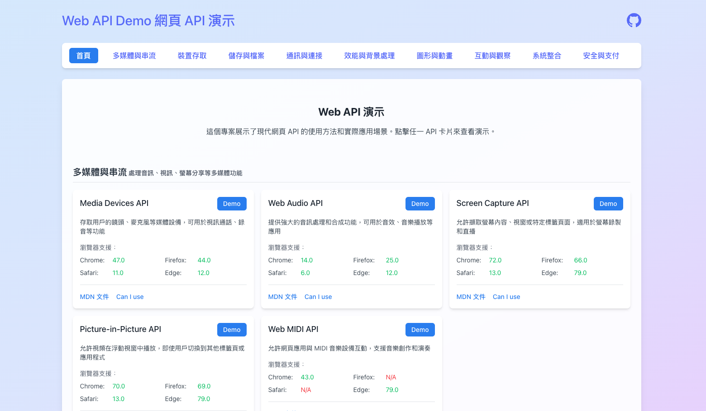

# Web API Demo 網頁 API 演示 (Web API Demonstration)



這個專案展示了現代網頁 API 的使用方法和實際應用場景。透過互動式的演示和程式碼範例，幫助開發者更好地理解和使用這些強大的網頁功能。

This project demonstrates the usage and practical applications of modern Web APIs. Through interactive demonstrations and code examples, it helps developers better understand and utilize these powerful web features.

## 功能特色 (Features)

- 清晰的 API 分類展示 (Clear API categorization)
- 互動式演示界面 (Interactive demo interface)
- 即時程式碼範例 (Real-time code examples)
- 瀏覽器相容性資訊 (Browser compatibility information)
- MDN 文件和 Can I Use 連結 (MDN documentation and Can I Use links)

## API 分類 (API Categories)

### 多媒體與串流 (Multimedia & Streaming)
- ✅ [MediaDevices API](https://developer.mozilla.org/zh-TW/docs/Web/API/MediaDevices)
- ✅ [Web Audio API](https://developer.mozilla.org/zh-TW/docs/Web/API/Web_Audio_API)
- ✅ [MediaRecorder API](https://developer.mozilla.org/zh-TW/docs/Web/API/MediaRecorder)
- ✅ [HTMLMediaElement](https://developer.mozilla.org/zh-TW/docs/Web/API/HTMLMediaElement)
- ✅ [MediaSource API](https://developer.mozilla.org/zh-TW/docs/Web/API/MediaSource)
- ✅ [AudioContext](https://developer.mozilla.org/zh-TW/docs/Web/API/AudioContext)
- ✅ [VideoTrackList](https://developer.mozilla.org/zh-TW/docs/Web/API/VideoTrackList)
- ✅ [AudioTrackList](https://developer.mozilla.org/zh-TW/docs/Web/API/AudioTrackList)
- ✅ [TextTrackList](https://developer.mozilla.org/zh-TW/docs/Web/API/TextTrackList)
- ✅ [TextTrackCue](https://developer.mozilla.org/zh-TW/docs/Web/API/TextTrackCue)
- ✅ [Canvas Capture MediaStream API](https://developer.mozilla.org/zh-TW/docs/Web/API/HTMLCanvasElement/captureStream)
- ✅ [Picture-in-Picture API](https://developer.mozilla.org/zh-TW/docs/Web/API/Picture-in-Picture_API)
- ✅ [Web MIDI API](https://developer.mozilla.org/zh-TW/docs/Web/API/Web_MIDI_API)
- ✅ [Screen Capture API](https://developer.mozilla.org/zh-TW/docs/Web/API/Screen_Capture_API)

### 裝置存取 (Device Access)
- ✅ [Geolocation API](https://developer.mozilla.org/zh-TW/docs/Web/API/Geolocation_API)
- ✅ [Battery Status API](https://developer.mozilla.org/zh-TW/docs/Web/API/Battery_Status_API)
- ✅ [Vibration API](https://developer.mozilla.org/zh-TW/docs/Web/API/Vibration_API)
- ✅ [Web Bluetooth API](https://developer.mozilla.org/zh-TW/docs/Web/API/Web_Bluetooth_API)
- ✅ [WebUSB API](https://developer.mozilla.org/zh-TW/docs/Web/API/USB)
- ✅ [Web Serial API](https://developer.mozilla.org/zh-TW/docs/Web/API/Serial)
- ✅ [WebHID API](https://developer.mozilla.org/zh-TW/docs/Web/API/WebHID_API)
- ✅ [Ambient Light Sensor API](https://developer.mozilla.org/zh-TW/docs/Web/API/AmbientLightSensor)
- ✅ [Device Motion & Orientation API](https://developer.mozilla.org/zh-TW/docs/Web/API/DeviceMotionEvent)
- ✅ [Contact Picker API](https://developer.mozilla.org/zh-TW/docs/Web/API/Contact_Picker_API)
- ✅ [Proximity Sensor API](https://developer.mozilla.org/zh-TW/docs/Web/API/Proximity_Events)
- ✅ [Magnetometer API](https://developer.mozilla.org/zh-TW/docs/Web/API/Magnetometer)
- ✅ [Accelerometer API](https://developer.mozilla.org/zh-TW/docs/Web/API/Accelerometer)
- ✅ [Gyroscope API](https://developer.mozilla.org/zh-TW/docs/Web/API/Gyroscope)
- ✅ [NFC API](https://developer.mozilla.org/zh-TW/docs/Web/API/Web_NFC_API)

### 儲存與檔案 (Storage & Files)
- ✅ [Local Storage API](https://developer.mozilla.org/zh-TW/docs/Web/API/Window/localStorage)
- ✅ [Session Storage API](https://developer.mozilla.org/zh-TW/docs/Web/API/Window/sessionStorage)
- ✅ [IndexedDB API](https://developer.mozilla.org/zh-TW/docs/Web/API/IndexedDB_API)
- ✅ [File API](https://developer.mozilla.org/zh-TW/docs/Web/API/File_API)
- ✅ [File System Access API](https://developer.mozilla.org/zh-TW/docs/Web/API/File_System_Access_API)
- ✅ [Drag and Drop API](https://developer.mozilla.org/zh-TW/docs/Web/API/HTML_Drag_and_Drop_API)
- ✅ [Cache API](https://developer.mozilla.org/zh-TW/docs/Web/API/Cache)
- ✅ [Cookie Store API](https://developer.mozilla.org/zh-TW/docs/Web/API/CookieStore)

### 通訊與連接 (Communication & Connectivity)
- ✅ [WebRTC API](https://developer.mozilla.org/zh-TW/docs/Web/API/WebRTC_API)
- ✅ [Broadcast Channel API](https://developer.mozilla.org/zh-TW/docs/Web/API/Broadcast_Channel_API)
- ✅ [WebSocket API](https://developer.mozilla.org/zh-TW/docs/Web/API/WebSocket)
- ✅ [Web Share API](https://developer.mozilla.org/zh-TW/docs/Web/API/Navigator/share)
- ✅ [Fetch API](https://developer.mozilla.org/zh-TW/docs/Web/API/Fetch_API)
- ✅ [XMLHttpRequest](https://developer.mozilla.org/zh-TW/docs/Web/API/XMLHttpRequest)
- ✅ [Beacon API](https://developer.mozilla.org/zh-TW/docs/Web/API/Beacon_API)
- ✅ [Server-Sent Events (EventSource)](https://developer.mozilla.org/zh-TW/docs/Web/API/EventSource)
- ✅ [Network Information API](https://developer.mozilla.org/zh-TW/docs/Web/API/Network_Information_API)
- [WebTransport API](https://developer.mozilla.org/en-US/docs/Web/API/WebTransport) ✅
- [Web Push API](https://developer.mozilla.org/en-US/docs/Web/API/Push_API) ✅

### 效能與背景處理 (Performance & Background Processing)
- ✅ [Web Workers API](https://developer.mozilla.org/zh-TW/docs/Web/API/Web_Workers_API)
- ✅ [Service Workers API](https://developer.mozilla.org/zh-TW/docs/Web/API/Service_Worker_API)
- ✅ [Shared Workers API](https://developer.mozilla.org/zh-TW/docs/Web/API/SharedWorker)
- ✅ [Background Sync API](https://developer.mozilla.org/zh-TW/docs/Web/API/Background_Sync_API)
- ✅ [Background Fetch API](https://developer.mozilla.org/zh-TW/docs/Web/API/Background_Fetch_API)
- ✅ [Background Tasks API](https://developer.mozilla.org/zh-TW/docs/Web/API/Background_Tasks_API)
- ✅ [Performance API](https://developer.mozilla.org/zh-TW/docs/Web/API/Performance_API)
- ✅ [Navigation Timing API](https://developer.mozilla.org/zh-TW/docs/Web/API/Navigation_timing_API)
- ✅ [Resource Timing API](https://developer.mozilla.org/zh-TW/docs/Web/API/Resource_Timing_API)
- ✅ [User Timing API](https://developer.mozilla.org/zh-TW/docs/Web/API/User_Timing_API)
- ✅ [Paint Timing API](https://developer.mozilla.org/zh-TW/docs/Web/API/Paint_Timing_API)
- ✅ [Long Tasks API](https://developer.mozilla.org/zh-TW/docs/Web/API/Long_Tasks_API)
- ✅ [Idle Detection API](https://developer.mozilla.org/zh-TW/docs/Web/API/Idle_Detection_API)

### 圖形與動畫 (Graphics & Animation)
- ✅ [WebGL API](https://developer.mozilla.org/zh-TW/docs/Web/API/WebGL_API)
- ✅ [WebGL2 API](https://developer.mozilla.org/zh-TW/docs/Web/API/WebGL2RenderingContext)
- ✅ [WebGPU API](https://developer.mozilla.org/zh-TW/docs/Web/API/WebGPU_API)
- ✅ [Web Animations API](https://developer.mozilla.org/zh-TW/docs/Web/API/Web_Animations_API)
- ✅ [Canvas API](https://developer.mozilla.org/zh-TW/docs/Web/API/Canvas_API)
- ✅ [SVG API](https://developer.mozilla.org/zh-TW/docs/Web/API/SVGElement)
- ✅ [OffscreenCanvas API](https://developer.mozilla.org/zh-TW/docs/Web/API/OffscreenCanvas)
- ✅ [ImageBitmap API](https://developer.mozilla.org/zh-TW/docs/Web/API/ImageBitmap)
- [ImageCapture API](https://developer.mozilla.org/en-US/docs/Web/API/ImageCapture) ✅
- [CSS Typed OM API](https://developer.mozilla.org/en-US/docs/Web/API/CSS_Typed_OM_API) ✅

### 互動與觀察 (Interaction & Observation)
- ✅ [Gamepad API](https://developer.mozilla.org/zh-TW/docs/Web/API/Gamepad_API)
- ✅ [Pointer Events API](https://developer.mozilla.org/zh-TW/docs/Web/API/Pointer_events)
- ✅ [Touch Events API](https://developer.mozilla.org/zh-TW/docs/Web/API/Touch_events)
- ✅ [Mouse Events API](https://developer.mozilla.org/zh-TW/docs/Web/API/MouseEvent)
- ✅ [Keyboard Events API](https://developer.mozilla.org/zh-TW/docs/Web/API/KeyboardEvent)
- ✅ [Wheel Events API](https://developer.mozilla.org/zh-TW/docs/Web/API/WheelEvent)
- ✅ [Intersection Observer API](https://developer.mozilla.org/zh-TW/docs/Web/API/Intersection_Observer_API)
- ✅ [Resize Observer API](https://developer.mozilla.org/zh-TW/docs/Web/API/Resize_Observer_API)
- ✅ [Mutation Observer API](https://developer.mozilla.org/zh-TW/docs/Web/API/MutationObserver)
- ✅ [Page Visibility API](https://developer.mozilla.org/zh-TW/docs/Web/API/Page_Visibility_API)
- ✅ [Web Speech API](https://developer.mozilla.org/zh-TW/docs/Web/API/Web_Speech_API)
- ✅ [EyeDropper API](https://developer.mozilla.org/zh-TW/docs/Web/API/EyeDropper_API)

### 系統整合 (System Integration)
- ✅ [Clipboard API](https://developer.mozilla.org/zh-TW/docs/Web/API/Clipboard_API)
- ✅ [Fullscreen API](https://developer.mozilla.org/zh-TW/docs/Web/API/Fullscreen_API)
- ✅ [Web Notifications API](https://developer.mozilla.org/zh-TW/docs/Web/API/Notifications_API)
- ✅ [Screen Orientation API](https://developer.mozilla.org/zh-TW/docs/Web/API/Screen_Orientation_API)
- ✅ [Wake Lock API](https://developer.mozilla.org/zh-TW/docs/Web/API/WakeLock)
- ✅ [Web Locks API](https://developer.mozilla.org/zh-TW/docs/Web/API/Web_Locks_API)
- [Presentation API](https://developer.mozilla.org/en-US/docs/Web/API/Presentation_API) ✅
- ✅ [Payment Request API](https://developer.mozilla.org/zh-TW/docs/Web/API/Payment_Request_API)
- ✅ [Credential Management API](https://developer.mozilla.org/zh-TW/docs/Web/API/Credential_Management_API)
- [Badging API](https://developer.mozilla.org/zh-TW/docs/Web/API/Badging_API)
- [File Handling API](https://developer.mozilla.org/zh-TW/docs/Web/API/File_System_Access_API)

### 安全與支付 (Security & Payment)
- ✅ [Web Crypto API](https://developer.mozilla.org/zh-TW/docs/Web/API/Web_Crypto_API)
- ✅ [Permissions API](https://developer.mozilla.org/zh-TW/docs/Web/API/Permissions_API)
- ✅ [Content Security Policy (CSP)](https://developer.mozilla.org/zh-TW/docs/Web/HTTP/CSP)
- ✅ [Subresource Integrity (SRI)](https://developer.mozilla.org/zh-TW/docs/Web/Security/Subresource_Integrity)
- ✅ [Cross-Origin Resource Sharing (CORS)](https://developer.mozilla.org/zh-TW/docs/Web/HTTP/CORS)
- ✅ [Referrer Policy API](https://developer.mozilla.org/zh-TW/docs/Web/HTTP/Headers/Referrer-Policy)
- ✅ [Feature Policy API](https://developer.mozilla.org/zh-TW/docs/Web/HTTP/Feature_Policy)

## 開始使用 (Getting Started)

1. 安裝依賴 (Install dependencies)：
```bash
npm install
```

2. 啟動開發伺服器 (Start development server)：
```bash
npm run dev
```

3. 打開瀏覽器訪問 (Open in browser)：
```
http://localhost:5173
```

## 瀏覽器支援 (Browser Support)

本專案中的 API 支援度依據各個瀏覽器版本而不同，詳細資訊請參考各 API 展示頁面的瀏覽器相容性表格。

API support in this project varies depending on browser versions. Please refer to the browser compatibility tables on each API demonstration page for detailed information.

## 技術棧 (Tech Stack)

- React
- TypeScript
- Vite
- Tailwind CSS

## 相關資源 (Related Resources)

- [MDN Web API 參考 (MDN Web API Reference)](https://developer.mozilla.org/zh-TW/docs/Web/API)
- [Can I use](https://caniuse.com/)
- [Web API 索引 (Web API Index)](https://developer.mozilla.org/zh-TW/docs/Web/API)